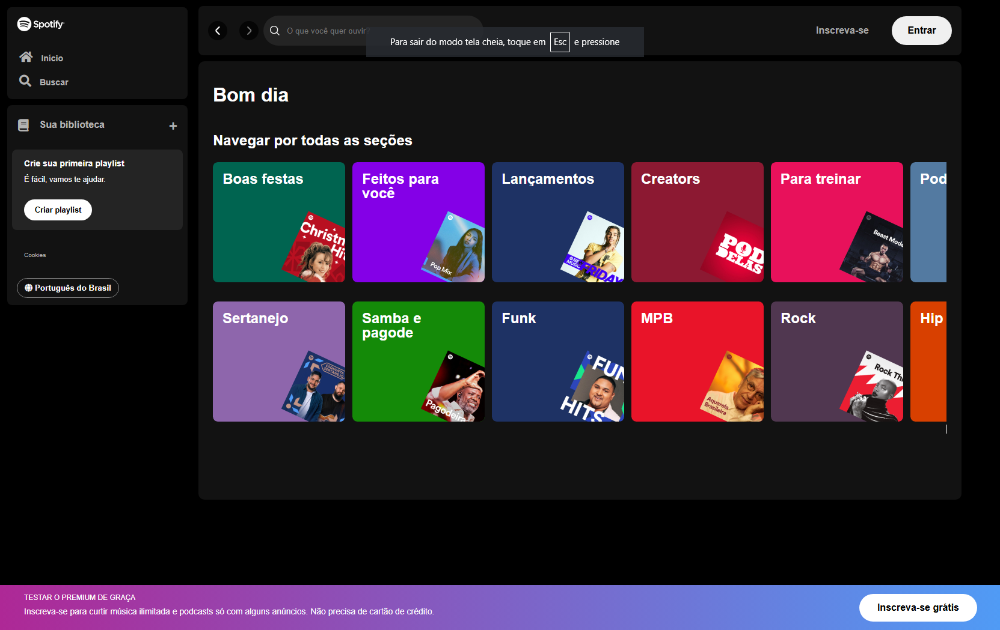

<h1> Projeto Spotify </h1>
 

<h2> Este foi o projeto que aprendi no evento Imersão Front-end da Alura </h2>

 Uma aplicação web que simula a experiência de streaming de música, permitindo explorar gêneros, criar playlists e ouvir podcasts. 

<h2> Introdução </h2>

O Projeto Spotify é uma aplicação que visa proporcionar uma experiência rica e intuitiva para amantes de música. Os usuários podem navegar por diferentes seções e personalizar suas playlists.

## Tecnologias utilizadas
* HTML
* CSS
* JavaScript
* Responsividade
* APIs de música 

## Ferramentas
* Visual Studio Code
* Git
* GitHub
* Node.Js

## Rodando o projeto

<a href="https://daniel-pantoja.github.io/spotify/" target="_blank">Clique aqui</a> para acessá-lo

